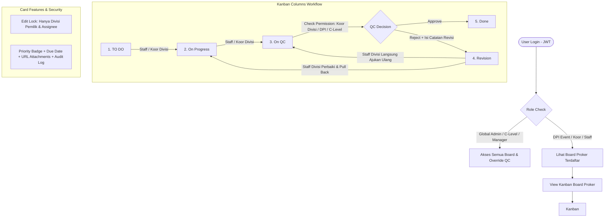

# Big Picture & Visual Flow — BNCC Proker Kanban

Dokumen ini berisi gambaran umum arsitektur visual, alur kerja sistem, dan **Prompt khusus untuk AI Image Generator / Diagram Generator** agar dapat divisualisasikan dan di-QC sebelum eksekusi coding.

---

## 1. Flowchart System (Mermaid Diagram)

---

## 2. High-Level Visual Architecture (Notion-Style Modal Layout)

1. **Screen 1: Proker Dashboard**
   - Grid Card berisi daftar Proker Aktif & Arsip (`Active` / `Archived`).
   - Tombol `+ Create New Proker` (DPI Event / C-Level).

2. **Screen 2: Kanban Board Main View**
   - Header: Judul Proker, Filter Bar (`All Divisions`, `My Division Only`, `Priority: High/Mid/Low`).
   - 5 Kolom Horisontal: `TO DO`, `On Progress`, `On QC`, `Revision`, `Done`.
   - Card Component: Title, Division Tag, Assignee Avatars, Priority Badge, Due Date, Attachment Counter.

3. **Screen 3: Card Detail & Edit Modal (Notion-Style Layout)**
   - **Header Section**: Full Title (Editable), Status Badge Dropdown (`TO DO` s/d `Done`).
   - **Properties Grid (Top Metadata)**:
     - `Status`: Badge Dropdown.
     - `Assignee`: Multi-select User Avatars / Names.
     - `Division`: Single-select Tag (Pill Badge).
     - `Priority`: Dropdown (`Low`, `Mid`, `High`).
     - `Due Date`: Date picker.
     - `Attachments`: List of HTTP/HTTPS URLs.
   - **Main Body**: Description (Markdown / Rich Text).
   - **Bottom / Sidebar Section**:
     - `Catatan Revisi` (diisi saat status `Revision`).
     - `Activity & Audit Log` (Timeline perpindahan status & aksi user).

4. **Screen 4: QC Gatekeeper Revision Action**
   - Saat card dipindahkan dari `On QC` ke `Revision`, modal Notion membuka section **Catatan Revisi** yang wajib diisi sebelum status tersimpan.

---

## 3. Prompts untuk AI Image Generator (Midjourney / DALL-E / Flux / Ideogram)

### Prompt 1: Main Kanban Board UI
> Clean modern web dashboard interface for a Kanban project management tool named "BNCC Proker Kanban". Dark mode UI, high contrast, minimalist design system using Tailwind CSS style. Display 5 horizontal columns labeled "TO DO", "On Progress", "On QC", "Revision", and "Done". Cards inside columns have colorful division badges (e.g., "Public Relations" in blue, "Creative Team" in purple), priority badges (High in red), due date indicators, and user avatar circles. Clean typography, SaaS dashboard layout, 8k resolution, UI/UX design inspiration from Linear app and Trello.

### Prompt 2: Notion-Style Card Detail Modal UI
> Notion-style dark mode page modal overlaying a Kanban board. Top section features a large card title "1. Early Bird — Fleksibel & Dapat Dikonfigurasi". Below title, vertical property list with icons: Status dropdown "On QC (Staging)", Assignees multi-avatar, Division badge "Creative Team", Priority "High", Due Date "12 Oct 2026". Main content area shows rich text description followed by a dedicated "Catatan Revisi" feedback block and an Activity Audit Log timeline at the bottom. Sleek modern UI design, clean typography.

---

## 4. Prompt untuk AI Diagram Generator (Napkin.ai / Whimsical / Eraser.io)

> Create a process flow diagram for a Project Management Kanban System with 5 stages: TO DO, On Progress, On QC, Revision, and Done. Highlight a strict permission gate at the 'On QC' stage where only Project Leaders or Division Coordinators can approve to 'Done' or send back to 'Revision' with required feedback notes. Show division-based card tagging and multi-user assignment features.
