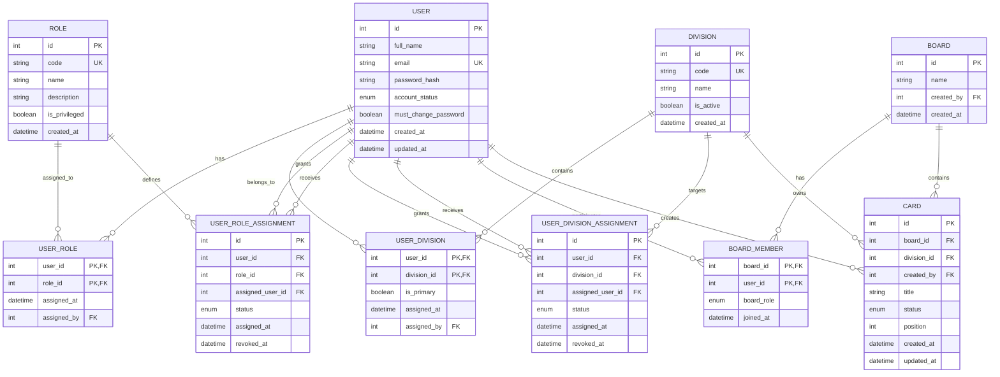

# ERD — User, Role, Division, dan Authorization

> **Status:** Proposed design
>
> ERD ini mendukung self-registration, multiple roles per user, multiple divisions per user, serta pengelolaan authorization oleh Super Admin.

## 1. Entity Relationship Diagram



## 2. Core Relationships

| Relationship | Cardinality | Purpose |
|---|---:|---|
| `USER` → `USER_ROLE` → `ROLE` | M:N | Satu user dapat memiliki beberapa role. |
| `USER` → `USER_DIVISION` → `DIVISION` | M:N | Satu user dapat tergabung dalam satu atau beberapa divisi. |
| `USER` → `USER_ROLE_ASSIGNMENT` | 1:N | Audit pemberian/pencabutan role oleh Super Admin. |
| `USER` → `USER_DIVISION_ASSIGNMENT` | 1:N | Audit penempatan/pencabutan user dari divisi. |
| `USER` → `BOARD_MEMBER` → `BOARD` | M:N | User dapat berpartisipasi pada beberapa board. |
| `BOARD` → `CARD` | 1:N | Board memiliki banyak card Kanban. |
| `DIVISION` → `CARD` | 1:N | Card dapat dikaitkan dengan divisi pemilik/penanggung jawab. |

## 3. Master Data Divisi BNCC

Seeder harus membuat lima divisi berikut sebagai master data. Seeder **tidak** perlu membuat akun user berdasarkan divisi.

| Code | Name |
|---|---|
| `PR` | Public Relation |
| `EEO` | Internal and External Event Organizer |
| `HRD` | Human Resource and Development |
| `RND` | Research and Development |
| `LNT` | Learning and Training |

> Jika nomenklatur resmi organisasi menggunakan `IIO` dan `EEO` sebagai nama terpisah, model ini dapat diubah menjadi enam divisi. Untuk requirement saat ini, keduanya diperlakukan sebagai satu divisi `EEO`.

## 4. Role yang Direkomendasikan

| Code | Scope | Privilege |
|---|---|---|
| `STAFF` | User/division | Role default setelah signup. Tidak dapat mengatur role user lain. |
| `KOOR_DIVISION` | Division | Mengelola atau melakukan QC atas aktivitas divisinya sendiri. |
| `BOARD_ADMIN` | Board | Mengelola board dan member board. |
| `GLOBAL_ADMIN` | Global | Super Admin. Dapat mengatur role, divisi, board, dan authorization user. |

Role tidak boleh dipilih bebas oleh user saat signup. User baru selalu mendapat role non-privileged `STAFF` sampai role lain diberikan oleh `GLOBAL_ADMIN`.

## 5. Aturan Authorization

Authorization dievaluasi dari kombinasi **user status + role + division + board membership**, bukan dari satu role tunggal.

```text
canManageUser(actor, target)
  = actor.account_status == ACTIVE
    AND actor has GLOBAL_ADMIN

canManageDivisionData(actor, division)
  = actor has GLOBAL_ADMIN
    OR actor has KOOR_DIVISION assigned to division

canManageBoard(actor, board)
  = actor has GLOBAL_ADMIN
    OR actor is BOARD_ADMIN on board

canApproveQc(actor, card)
  = actor has GLOBAL_ADMIN
    OR actor is BOARD_ADMIN on card.board
    OR actor has KOOR_DIVISION for card.division
```

## 6. Account Lifecycle

```text
SELF_REGISTERED
      |
      v
PENDING_VERIFICATION (optional)
      |
      v
ACTIVE + STAFF
      |
      |-- GLOBAL_ADMIN assigns additional role/division
      v
ACTIVE + multiple roles/divisions
      |
      v
SUSPENDED / DEACTIVATED
```

### Security rules

1. Password disimpan hanya sebagai `password_hash` menggunakan Argon2id atau bcrypt.
2. Password plaintext tidak disimpan di seed, repository, atau file Markdown.
3. `GLOBAL_ADMIN`, `BOARD_ADMIN`, dan `KOOR_DIVISION` tidak boleh diberikan melalui self-registration.
4. Perubahan role/divisi harus dicatat dengan actor, target, timestamp, dan status assignment.
5. User yang suspended/deactivated tidak boleh melakukan operasi terproteksi.
6. `email` harus unique dan digunakan sebagai identifier login.
7. Akun hasil import massal sebaiknya menggunakan temporary password dan wajib mengganti password saat login pertama.

## 7. Catatan Implementasi terhadap Schema Lama

Jika schema saat ini masih memiliki satu role langsung pada `User` atau `BoardMember`, migrasi sebaiknya dilakukan bertahap:

1. Tambahkan tabel `Role`, `UserRole`, `Division`, dan `UserDivision`.
2. Seed lima master division dan role dasar secara idempotent.
3. Migrasikan role lama ke `UserRole`.
4. Ubah authorization backend agar membaca relasi role/divisi.
5. Pertahankan field lama sementara untuk backward compatibility.
6. Hapus field lama setelah seluruh controller, frontend, dan test suite sudah memakai model baru.

## 8. Constraint Database yang Wajib

- `User.email` unique.
- `Role.code` unique.
- `Division.code` unique.
- Composite unique pada `UserRole(user_id, role_id)`.
- Composite unique pada `UserDivision(user_id, division_id)`.
- Hanya satu `UserDivision.is_primary = true` per user.
- Assignment yang sudah revoked tidak boleh dipakai untuk authorization aktif.
- Foreign key assignment harus memakai user actor yang valid.

## 9. Seed Data Minimum

Seeder minimum hanya membuat:

- lima division master;
- role master (`STAFF`, `KOOR_DIVISION`, `BOARD_ADMIN`, `GLOBAL_ADMIN`);
- satu akun bootstrap `GLOBAL_ADMIN` hanya jika environment bootstrap mengharuskannya.

Seeder **tidak** membuat akun koordinator atau staff berdasarkan nama divisi. Daftar nama user akan di-import setelah data final diberikan dan role masing-masing ditentukan.
