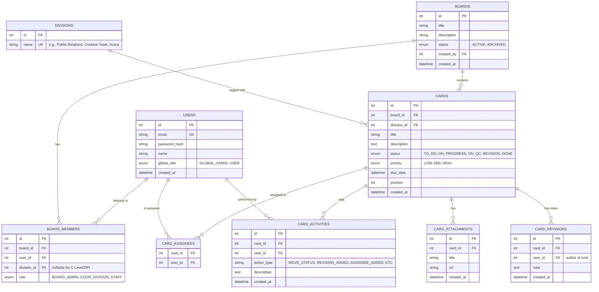

# Data Model Documentation — BNCC Proker Kanban

## ER Diagram

## Relasi & Constraint Rules
1. **UNIQUE(email)** pada tabel `USERS`.
2. **UNIQUE(board_id, user_id)** pada `BOARD_MEMBERS`.
3. **PRIMARY KEY(card_id, user_id)** pada `CARD_ASSIGNEES`.
4. **FOREIGN KEY Constraint CASCADE** saat Card atau Board dihapus.
