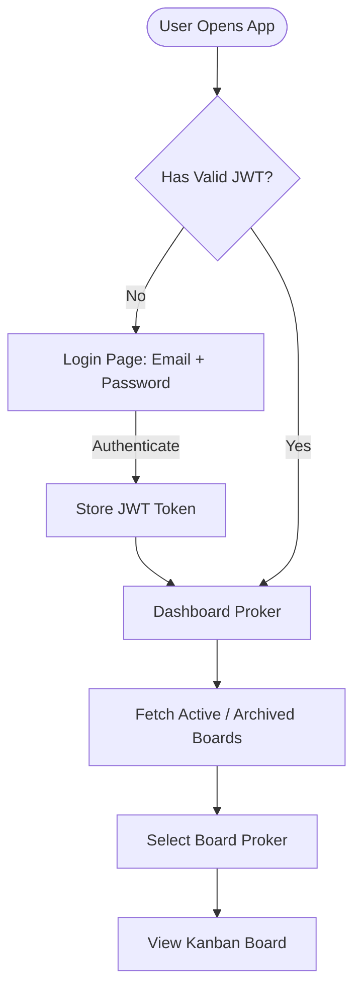
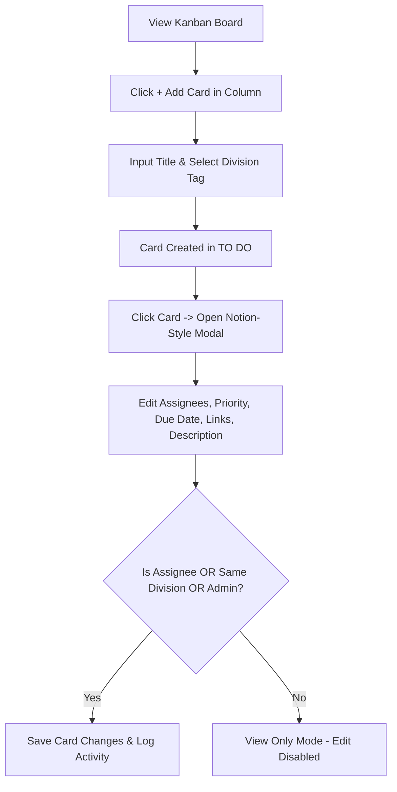
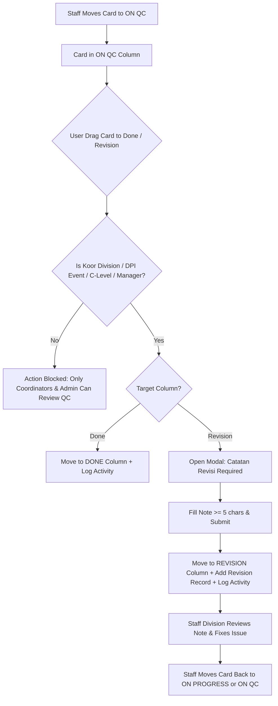

# User Flows & Screen Directory — BNCC Proker Kanban

## 1. User Flows (Mermaid Flowcharts)

### 1.1 Auth & Board Access Flow

### 1.2 Card Creation & Editing Flow

### 1.3 QC Approval & Revision Loop Flow

---

## 2. Screen Directory

| Screen Name | Route | Core Components | Who Can Access | Data Required |
|---|---|---|---|---|
| **Login / Register** | `/login` | Form Email/Password, Submit Button | Public / Unauthenticated | User credentials |
| **Proker Dashboard** | `/` | Proker Grid Card, Filter (Active/Archived), Modal `+ New Board` | All Authenticated Users | User's Board List |
| **Kanban Board View** | `/board/:id` | Header, Filter Bar (Division, Priority), 5 Columns (`TO DO`, `On Progress`, `On QC`, `Revision`, `Done`) | Board Members + Global Admins | Board Details, Columns, Cards, Divisions |
| **Notion-Style Card Modal** | Overlay on `/board/:id` | Property List (Status, Assignees, Division, Priority, Due Date, Links), Description Editor, Catatan Revisi, Activity Log | Board Members | Card Detail, Assignees, Attachments, Revisions, Activities |
| **Board Settings / Team** | `/board/:id/settings` | Member List Table, Role Selector (`Board Admin`, `Koor Division`, `Staff`), Division Assign | Board Admin, DPI Event, C-Level, Manager | Board Members, Roles, Divisions |
